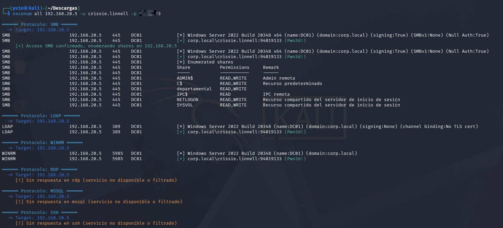

# nxcenum

Bash wrapper around [netexec](https://www.netexec.wiki/) to quickly scope how far a known/compromised
credential reaches across multiple services (SMB, LDAP, WinRM, RDP, MSSQL, SSH) in a single run.

Given one confirmed username/password (or a set of targets), `nxcenum` runs the auth check against
every requested protocol, and when SMB access succeeds it automatically lists the accessible shares.
Built for the "I have valid creds, how far do they go" step of an authorized penetration test or
Active Directory assessment.

## Features

- Checks one credential against multiple protocols (`smb`, `ldap`, `winrm`, `rdp`, `mssql`, `ssh`, or `all`) in one command.
- Accepts a single target or a file with one target per line.
- Automatically enumerates SMB shares when authentication succeeds.
- Highlights successes (`[+]`), failures (`[-]`) and admin-equivalent access (`(Pwn3d!)`) in color.
- Explicit `[!] No response` message when a protocol/port doesn't answer, instead of silent output.
- Filters out noisy Python `SyntaxWarning` lines from underlying dependencies (impacket/lsassy).
- Optional `-o <file>` flag to save clean, color-free output for reporting.

## Installation

Requires [netexec](https://github.com/Pennyw0rth/NetExec) to be installed and available in your `PATH`.

```bash
git clone https://github.com/<your-username>/nxcenum.git
cd nxcenum
chmod +x nxcenum
sudo mv nxcenum /usr/local/bin/
```

## Usage

```
nxcenum <protocols|all> <targets> -u <username> -p <password> [-o <output_file>]
```

### Flags

| Flag | Required | Description |
|------|----------|-------------|
| `<protocols\|all>` | Yes | Comma-separated list of protocols to check (`smb,ldap,winrm`), or `all` for every supported protocol (`smb`, `ldap`, `winrm`, `rdp`, `mssql`, `ssh`). Positional, must be the first argument. |
| `<targets>` | Yes | A single IP/hostname, or a path to a file with one target per line. Positional, must be the second argument. |
| `-u <username>` | Yes | Username to authenticate with. |
| `-p <password>` | Yes | Password to authenticate with. |
| `-o <output_file>` | No | Saves plain-text results (no color codes) to the given file, in addition to the colored terminal output. Ideal for pasting into a report. |

### Examples

Check every supported protocol against a single host:
```bash
nxcenum all 10.10.10.10 -u bob -p 'P@ssw0rd!'
```

Check only SMB and WinRM against a list of targets, saving the results for a report:
```bash
nxcenum smb,winrm targets.txt -u bob -p 'P@ssw0rd!' -o results.txt
```

## Demo

Full protocol sweep (`all`) against a domain controller with a valid low-privileged credential that
turns out to have admin-equivalent access:



SMB shows admin access (`Pwn3d!`) plus the full share listing, LDAP and WinRM confirm the same access
level, and RDP/MSSQL/SSH report cleanly that the service didn't respond instead of failing silently.

## Notes

- Does not pre-check ports; netexec runs against every target regardless of port state, so output stays
  consistent across the whole target list.
- The `-o` output file is always plain text (ANSI color codes stripped), safe to paste directly into a report.

## Disclaimer

This tool is intended exclusively for authorized security testing (penetration tests, red team
engagements, CTFs, or your own lab environments) where you have explicit permission to test the target
systems. Using it against systems you do not own or lack authorization for is illegal. The author is
not responsible for misuse.

## Credits

This tool started as a rewrite of [NTHSec/nxcspray](https://github.com/NTHSec/nxcspray), which inspired
the original protocol-sweeping approach. `nxcenum` has since diverged significantly in scope and
functionality (credential scoping instead of spraying, automatic SMB enumeration, output filtering,
color highlighting, file export), but credit belongs to the original author for the idea.

## License

MIT, see [LICENSE](LICENSE).
